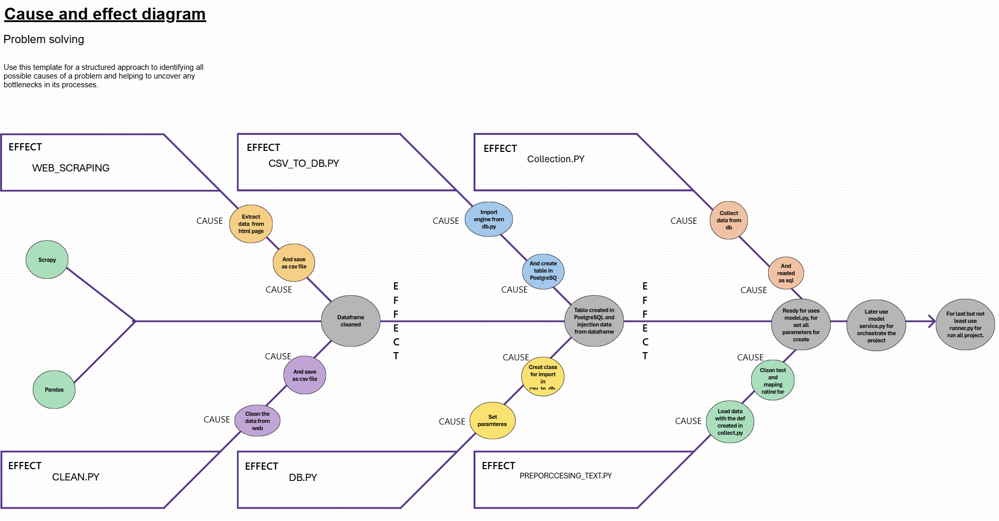
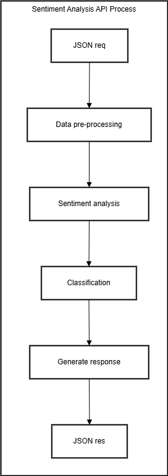

# Análisis de Sentimientos con ML y MLOps

## Resumen del Proyecto
Este proyecto se centra en analizar el sentimiento de textos (positivo, negativo o neutral) utilizando técnicas avanzadas de procesamiento de lenguaje natural (NLP) y un enfoque MLOps para asegurar una integración y despliegue continuo en ambientes productivos.

## Motivación y Objetivos
- **Motivación:**  
  Explica la necesidad de contar con una herramienta que interprete automáticamente el tono de los textos, facilitando la toma de decisiones en áreas como atención al cliente, análisis de opiniones en redes sociales, etc.
- **Objetivos:**  
  - Desarrollar un modelo robusto de análisis de sentimientos.
  - Integrar una API que permita el consumo del modelo en tiempo real.
  - Implementar buenas prácticas de MLOps para asegurar escalabilidad y mantenimiento.

### Diagrama de Arquitectura
  
_Descripción:_  
El diagrama muestra cómo se recibe los datos de web scraping, se procesa mediante técnicas de NLP, se analiza el sentimiento y se devuelve una respuesta.

### Pipeline de Procesamiento
1. **Recepción de Datos:**  
   El sistema recibe las reseñas a traves de Scrapy con web scraping.
2. **Preprocesamiento:**  
   Se aplican técnicas de limpieza de texto con regex y stop words de NLTK.
3. **Análisis del Sentimiento:**  
   El modelo, entrenado con datos etiquetados, evalúa el texto y genera una clasificación (por ejemplo, positivo, negativo, neutral).
4. **Respuesta:**  
   Se devuelve un JSON con el resultado del análisis y métricas asociadas.

#### Ilustración del Proceso
  
_Esta imagen detalla las etapas por las que pasa el texto desde su recepción hasta la entrega del resultado._

## Demostraciones Visuales

- **Dashboard de Monitorización:**  
    
    
  _Descripción:_ Visualización en tiempo real de las solicitudes y respuestas procesadas por la API a traves de Google Cloud Run.

- **Ejemplo de Respuesta de la API:**  
    
  _Descripción:_ Ejemplo del JSON devuelto que muestra la clasificación del sentimiento y el score correspondiente.

## Tecnologías y Herramientas Utilizadas
- **Lenguaje:** Python
- **Framework de API:** Flask
- **Bibliotecas de NLP:** NLTK
- **Modelo de Machine Learning:** PyTorch
- **MLOps:** Docker, integración con CI/CD (GitHub Actions)
- **Despliegue en la Nube:** GCR

## Conclusiones y Futuras Mejoras
- **Conclusiones:**  
  Resumen de los logros y la efectividad del modelo.
- **Futuras Mejoras:**  
  Ampliar el proyecto, como mejorar la precisión del modelo, soporte para múltiples idiomas o integración de nuevas fuentes de datos.

