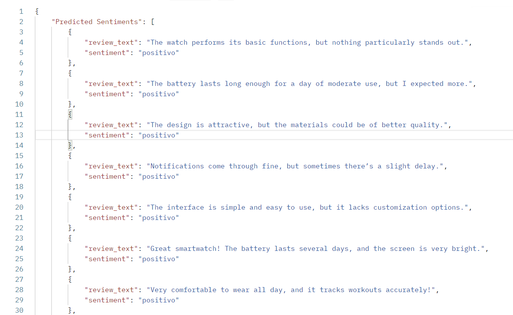

# Proyecto Integral de Análisis de Sentimiento: Fusionando Data Science y MLOps

## Resumen del Proyecto
Este proyecto ejemplifica la sinergia perfecta entre Data Science y MLOps, ofreciendo una solución integral y escalable para el análisis de sentimiento en textos (positivo, negativo o neutral). Diseñado para entornos productivos, integra un flujo de trabajo end-to-end que abarca desde la adquisición y procesamiento de datos hasta el despliegue automatizado en la nube.

## Motivación y Objetivos
- **Motivación:**  
  Se toma importancia a la necesidad de contar con una herramienta que interprete automáticamente el tono de los textos, facilitando la toma de decisiones en áreas como atención al cliente, análisis de opiniones en redes sociales, etc.
- **Objetivos:**  
  - Desarrollar un modelo robusto de análisis de sentimientos.
  - Integrar una API que permita el consumo del modelo en tiempo real.
  - Implementar buenas prácticas de MLOps para asegurar escalabilidad y mantenimiento.

---

## Pipeline de Construcción del Modelo (Model Building)

- **Extracción de Datos (Web Scraping):**  
  Automatización de la recopilación de datos de diversas fuentes, garantizando la diversidad y relevancia del conjunto de datos.

- **Procesamiento y Transformación (ETL):**  
  Implementación de procesos de extracción, transformación y carga para limpiar y estructurar los datos, asegurando la calidad y consistencia necesaria para un entrenamiento robusto.

- **Desarrollo y Entrenamiento del Modelo:**  
  Diseño y optimización de algoritmos de Machine Learning para la clasificación de sentimientos, con validación rigurosa para alcanzar altos niveles de precisión y generalización.

---

## Pipeline de Inferencia y Despliegue (Model Inference)

- **Construcción de la API:**  
  Desarrollo de una API RESTful que expone el modelo de ML, permitiendo su integración sencilla con aplicaciones y servicios externos.

- **Contenerización con Docker:**  
  Creación de imágenes Docker para encapsular la aplicación, facilitando su portabilidad y garantizando un entorno de ejecución consistente.

- **Despliegue en Google Cloud Run:**  
  Implementación en un entorno de nube gestionado que permite escalabilidad automática y alta disponibilidad, adaptándose a la demanda en tiempo real.

- **Automatización CI/CD con GitHub Actions:**  
  Integración de pipelines de integración y despliegue continuo que automatizan pruebas, actualizaciones y despliegues, reduciendo errores y acelerando la iteración.

---

## Valor Estratégico

Este proyecto optimiza el ciclo de desarrollo e implementación, ofreciendo una solución innovadora que cumple con los estándares actuales de escalabilidad, confiabilidad y eficiencia. Su enfoque modular y automatizado lo convierte en una propuesta atractiva para organizaciones que buscan implementar soluciones de inteligencia artificial en entornos de producción con alta demanda operativa.

**Ideal para empresas que buscan liderar en innovación y transformación digital, demostrando expertise en Data Science y MLOps.**

---

## Contexto
En este flujo de trabajo, el equipo de Model Building entrena y ajusta un modelo de machine learning especializado para el análisis de sentimientos. Una vez entrenado, el modelo es entregado al equipo de Model Inference para integrarlo en un entorno productivo a través de una API. Proporcionando una solución escalable, eficiente y fácil de usar para consumir predicciones del modelo.

## Operaciones Principales
El proyecto está estructurado en 5 etapas:

### 1. **Web Scraping**
   - **Descripción**: Extracción automatizada de reseñas y metadatos de productos desde sitios web.
   - **Herramientas**:
     - `Scrapy`  para HTML parsing y extracción de datos a mayor escala.

---

### 2. **Limpieza y Procesamiento de Datos**
   - **Descripción**: Transformación de datos crudos en datos estructurados y limpios.
   - **Tareas Clave**:
     - Eliminación de duplicados.
     - Normalización de textos (lowercase, eliminación de caracteres especiales).
     - Tratamiento de valores faltantes.
   - **Herramientas**: `Pandas`, `re` (expresiones regulares).

---

### 3. **ETL (Extracción, Transformación y Carga)**
   - **Descripción**: Implementación de un pipeline ETL para cargar los datos limpios en una base de datos.
   - **Proceso**:
     - **Extracción**: Datos limpios desde el archivo CSV, Book1.
     - **Transformación**: Optimizar datos para almacenamiento eficiente.
     - **Carga**: Inserción de datos en PostgreSQL mediante `SQLAlchemy`.
   - **Herramientas**:
     - `Pandas` y `SQLAlchemy` para operaciones ETL.
     - PostgreSQL para almacenamiento de datos.
   - **Consideraciones**:
     - Estructura de tablas optimizada para consultas rápidas.
     - Indexación de claves principales.
     - Gestor de conexiones a la base de datos.

---

### 4. **Almacenamiento en PostgreSQL**
   - **Descripción**: Almacenamiento estructurado y eficiente de los datos.
   - **Estructura de la Base de Datos**:
     - **Tabla Principal**: `review_analysis_`
       | Columna           | Tipo         | Descripción                          |
       |------------------ |--------------|--------------------------------------|
       | id                | SERIAL (PK)  | Identificador único de la reseña     |
       | author            | VARCHAR      | Nombre del producto                  |
       | date              | VARCHAR      | Fecha de la reseña                   |
       | header            | VARCHAR      | Preview de la reseña                 |
       | rating            | INTEGER      | Sentimiento (positivo, negativo...)  |
       | review            | TEXT         | Reseña del producto                  |
   - **Conexión Segura**: Uso de credenciales almacenadas en variables de entorno.
   - **Herramienta**: PostgreSQL con ORM `SQLAlchemy`.

---

### 5. **Análisis de Sentimiento**
   - **Descripción**: Identificación del sentimiento asociado a cada reseña.
   - **Método Utilizado**:
     - Análisis de Sentimiento Basado en Redes Neuronales Supervisadas. Mediante el entrenamiento en datos etiquetados.
   - **Etiquetas de Sentimiento**:
     - Positivo
     - Negativo
     - Neutral
   - **Herramientas**: `PyTorch`, `NLTK`, `Scikit-Learn`.
   - **Cargado de datos**:
     - Utilizando la funcion creada load_data_and_prepare_dataframe, con esta se cargan los datos limpios desde PostgreSQL. Igual con la misma funcion, esta lo que hace es cargar los datos y con NLTK.corpus, da uso a stop words, para limpiar el texto de las reseñas. Entonces carga los datos limpios hacia el script de analisis de sentimiento.
   - **Transformacion de datos**:
     - Con el uso de TfidfVectorizer de Scikit Learn, para vectorizar el texto de las reseñas.
     - Con el uso de LabelEncoder de Scikit Learn, para convertir las etiquetas de postivo, negativo y neutral, hacia valores numericos 0,1,2.
   - **Separacion de datos**:
     - Con train_test_split de scikit learn, para dividir los datos, en datos de entrenamiento y prueba.
   - **Preparacion del Modelo**:
     - Se prepara el modelo con las utilidades de PyTorch para adaptar los datos a un TensorDataset. Convirtiendo esto en un DataLoader y creando las variables train_loader y test_loader.
   - **Arquitectura del Modelo**:
     - El modelo está diseñado utilizando PyTorch y sigue una estructura multicapa completamente conectada (fully connected). A continuación, se describe cada capa y su funcionalidad:
      Dando uso a 2 capas mas, iguales que la presentada:
      Capa 1:

        Tipo: Capa completamente conectada (Linear)
        Entrada: input_size (dimensionalidad de los datos de entrada)
        Salida: 256 neuronas
        Operaciones adicionales:
        Normalización por lotes (BatchNorm1d) para estabilizar el entrenamiento.
        Activación ReLU (ReLU) para introducir no linealidad.
        Dropout (Dropout) con una tasa de 0.5 para prevenir el sobreajuste.

        Capa de salida:

          Tipo: Capa completamente conectada (Linear)
          Entrada: 64
          Salida: num_classes (número de clases de salida para la clasificación).
          
      - Este modelo incluye mecanismos de regularización como la normalización por lotes y dropout, los cuales ayudan a mejorar la estabilidad y generalización durante el entrenamiento. La activación ReLU introduce no linealidad en las capas ocultas, permitiendo al modelo aprender patrones complejos en los datos de entrada.
   - **Entrenamiento del Modelo**:
     - Se pasan estos cuatro argumentos a la funcion, model, criterion, optimizer y train_loader. Despues en un ciclo for con un rango de 40 epocas de entrenamiento, para obtener la perdida por epoca.
   - **Evaluacion del Modelo**:
     - La función de evaluación del modelo se encarga de medir qué tan preciso es el modelo al trabajar con datos de prueba. Para hacerlo, primero se coloca el modelo en modo de evaluación, desactivando características como Dropout y ajustando BatchNorm para asegurar resultados consistentes. Luego, dentro de un bloque donde se desactivan los cálculos de gradientes (lo que ahorra memoria y acelera el proceso), el modelo procesa los datos en lotes. En cada lote, realiza predicciones y las compara con las etiquetas reales, contando cuántas acierta. Al final, se calcula la precisión dividiendo el número de aciertos entre el total de ejemplos, y este resultado se registra como un porcentaje.

### Diagrama de Arquitectura Model Building
  
_Descripción:_  
El diagrama muestra cómo se recibe los datos de web scraping, se procesa mediante técnicas de NLP, se analiza el sentimiento y se devuelve una respuesta.

### Problema que Resuelve
El proyecto aborda la necesidad de recopilar información no estructurada desde la web, procesarla adecuadamente, almacenarla de forma eficiente y analizar el sentimiento asociado a las opiniones de los usuarios sobre productos específicos. Esto permite identificar patrones clave, como percepción de productos o tendencias de mercado.
Usando Redes Neuornales, en lugar de transformadores, para no hacer uso de GPUS en la nube y evitar costos futuros. Pero si es el caso de poder abordar este tipo de procesamiento seria aun mejor, la prediccion de sentimiento con Fine-Tuning.

## Estructura del Proyecto Model Building
```
|-- .github/
|    |-- action.yml              # github actions CI/CD
|
|-- src/
|   |-- runner.py              #orchestrate the whole project
|   |
|   |-- config/
|   |   |-- __init__.py          # Inicializador de configuración.
|   |   |-- .env                   # Enviroments varaibles
|   |   |-- csv_to.py           # Extract data cleaned from Book1.csv and load into Database
|   |   |-- csv.py
|   |   |-- db.py                # Pydantic Functions
|   |   |-- logger.py          # Pydantic Functions
|   |   |-- model.py          # Pydantic Functions
|   |  
|   |-- db/
|   |   |-- db_model.py     # Characteristics of database
|   |
|   |-- model/
|   |   |-- models/
|   |   
|   |   |-- pipeline/
|   |   |-- Book1.csv                     # Datos de web scraping
|   |   |-- clean.py                        # Limpieza de datos con Pandas y Regexp
|   |   |-- collection.py                 # Collect data from database
|   |   |-- model_2.py                   # Using torch.jit way
|   |   |-- model.py                       # Using torch.save
|   |   |-- preproccessing_text.py #  Apply NLTK techniques to data from database
|   |   |-- model_service.py           # This module provides functionality for managing a ML model.
|   |
|   |-- logs/
|   |   |-- app.logs
|
|-- Makefile                # Archivo para automatización
|-- poetry.lock            # Lockfile de Poetry.
|-- pyproject.toml      # Archivo principal de Poetry.
|-- README.md         # Documentación del proyecto.
|-- setup.cfg              # Configuración adicional de Python.
|
```

#### Diagarama de Arquitecutra Model Inference
  
_Esta imagen detalla el proceso de Model Inference._

## Estructura del Proyecto Model Inference
```
|-- .github/
|   |-- ci/cd.yml
|
|-- app/
|   |-- run.py        # Código de la API (Flask).
|   |
|   |-- api/
|   |   |-- prediction.py # Codigo de blueprint
|   |  
|   |-- config/
|   |   |-- __init__.py      # Inicializador de configuración.
|   |   |-- .env             # Variables de entorno.
|   |   |-- model.py         # Configuración del modelo.
|   |
|   |-- model/
|   |   |-- Sentiment_model_complete.pth  # Modelo entrenado.
|   |   |-- vectorizer.pkl               # Vectorizador de texto.
|   |
|   |-- schema/
|   |   |-- review_analysis.py   # Esquema Pydantic.
|   |
|   |-- services/
|   |   |-- __init__.py
|   |   |-- model_inference.py  # Inferencia del modelo.
|
|-- Dockerfile              # Archivo de configuración para Docker.
|-- Makefile                # Archivo para automatización
|-- poetry.lock             # Lockfile de Poetry.
|-- pyproject.toml          # Archivo principal de Poetry.
|-- README.md               # Documentación del proyecto.
|-- setup.cfg               # Configuración adicional de Python.
```
- **app/**: Contiene el código principal de la API.
- **Dockerfile**: Archivo para contenerizar la aplicación.
- **pyproject.toml**: Dependencias del proyecto.
- **README.md**: Documentación del proyecto.

## Consideraciones de diseño
Este proyecto está diseñado como un prototipo funcional para demostrar habilidades técnicas en un entorno controlado. Actualmente, la API es sincrónica, lo que es adecuado para un único usuario que realiza solicitudes de análisis de sentimientos.

En un entorno de producción con múltiples usuarios o altos volúmenes de solicitudes, se recomienda implementar una arquitectura asíncrona

## Docker
  
Despues de que el equipo de model inference, haya creado la API, esta se usa para crear la imagen docker.
Dando paso a usar multi satge builds para reducir el peso de la imagen, he evitar tiempos altos de ejecucion en CI/CD CON GITHUB Actions.

#### Docker Image

   


## Google Clodu Run
   
Dando Uso a la imagen docker creada, haciendo deploy de esta en la nube de google.

- **Dashboard de Monitorización:**  
    
    
  _Descripción:_ Visualización en tiempo real de las solicitudes y respuestas procesadas por la API a traves de Google Cloud Run.

- **Ejemplo de Respuesta de la API:**  
    
  _Descripción:_ Ejemplo del JSON devuelto que muestra la clasificación del sentimiento y el score correspondiente.

## Tecnologías y Herramientas Utilizadas
- **Lenguaje:** Python
- **Framework de API:** Flask
- **Bibliotecas de NLP:** NLTK
- **Modelo de Machine Learning:** PyTorch
- **MLOps:** Docker, integración con CI/CD (GitHub Actions)
- **Despliegue en la Nube:** GCR

## Conclusiones y Futuras Mejoras
- **Conclusiones:**  
  En resumen, este proyecto representa un avance significativo en la integración de Data Science y MLOps, proporcionando una solución end-to-end para el análisis de sentimiento en textos. La arquitectura implementada garantiza un flujo de trabajo eficiente y escalable, abarcando desde la adquisición y procesamiento de datos hasta el despliegue automatizado en la nube. La utilización de pipelines automatizados para model building y model inference, junto con una robusta estrategia de CI/CD, subraya el compromiso con la calidad, la agilidad y la innovación. Este enfoque integral no solo resuelve desafíos actuales, sino que también prepara el camino para futuras mejoras y adaptaciones en entornos de alta demanda, posicionando al proyecto como una referencia en el ámbito de la inteligencia artificial aplicada a la industria.
- **Futuras Mejoras:**  
  Ampliar el proyecto, como mejorar la precisión del modelo, soporte para múltiples idiomas o integración de nuevas fuentes de datos.

